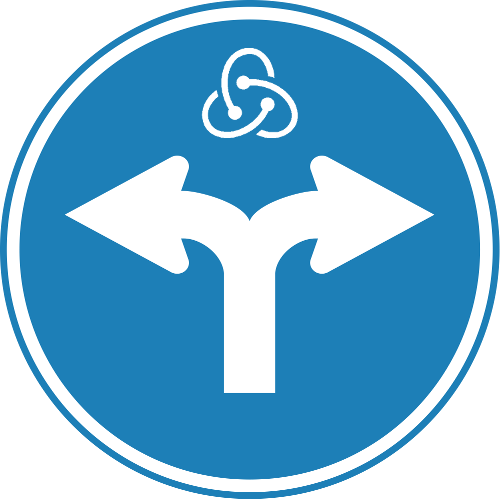

# ion-router
###### Connecting your url and redux state

[](https://codeclimate.com/github/cellog/ion-router) [](https://codeclimate.com/github/cellog/ion-router/coverage) [](https://travis-ci.org/cellog/ion-router) [](https://www.npmjs.com/package/ion-router)

Elegant powerful routing based on the simplicity of storing url as state

To install:

```bash
$ npm i -S ion-router
```

## New Documentation

Our documentation now lives [here](https://cellog.github.io/ion-router)

## License

MIT License

## Thanks

[](http://www.browserstack.com)

Huge thanks to [BrowserStack](http://www.browserstack.com) for providing
cross-browser testing on real devices, both automatic testing and manual testing.